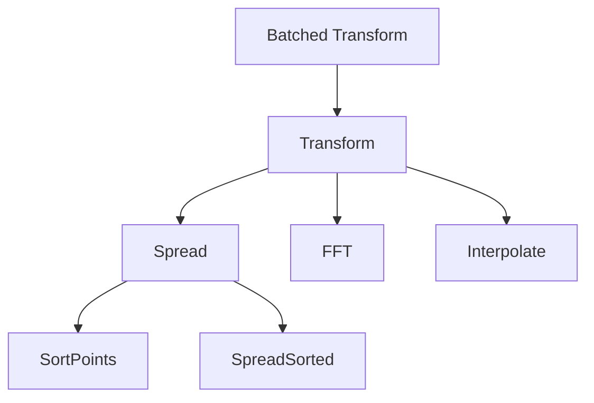

# Interface Design

This document outlines the high-level components of a `finufft` plan, with their interfaces and functionality.
This modular design enables us to replace selected components in order to enable optimizations.


## Plans and batched plans

The highest-level component which presents the external interaction with the user-facing API is the
batched plan. It represents a ready-to-execute transform, with a fixed number of modes, accuracy,
number of input points etc. It may contain platform-dependent quantities, and is not thread safe.
```c++
template<typename Fn, typename T, std::size_t Dim>
concept BatchedType1Plan = 
requires(
    Fn plan,
    std::size_t num_points,
    std::span<T const* const, Dim> coordinates,
    std::size_t num_transforms,
    T const* weights,
    T* result) {
    fn(num_points, coordinates, num_transforms, weights, result);
};
```

For simplicity, we provide a default implementation which lifts a single transform
to a batched transform (by calling that transform in a loop). The concept for a single
transform is similarly defined as:
```c++
template<typename Fn, typename T, std::size_t Dim>
concept Type1Plan =
requires(
    Fn plan,
    std::size_t num_points,
    std::span<T const* const, Dim> coordinates,
    std::size_t num_transforms,
    T* result) {
    fn(num_points, coordinates, weights, result);
}
```

## Default implementation path
We provide a default implementation which makes use of simple blocks to build up to the batched transforms.
Note that in some cases, it may be necessary to replace several blocks at once, merge or split them depending
on the nature of the required optimization.




## Spread-FFT-interpolate implementation

The main implementation of `finufft` uses an implementation based on a FFT transform on an upsampled regular grid,
preceded by spreading and followed by interpolation (for type-1 transforms).
Note that the plan interface itself may model different strategy (e.g. a direct summation strategy), but the
spread-fft-interpolate strategy is the main concern of this library.

We define a concept for each part of this implementation. Before we start, we define a convenience structure
representing a collection of non-uniform points as well as their associated weights.
```c++
template<typename T, std::size_t Dim>
struct nu_point_collection {
    std::size_t num_points;
    std::array<T*, Dim> coordinates;
    T* weights;
};
```

We now define the concepts for the spreading, fft and interpolation functors.
Note that these represent fully-bound functors, so that all external parameters
(e.g. number of target modes, kernel size, output mode ordering etc.) have been fixed in advance.
```c++
template<typename Fn, typename T, std::size_t Dim>
concept SpreadFunctor =
requires(
    Fn fn,
    nu_point_collection<T, Dim> input,
    T* uniform_output
) {
    fn(input, uniform_output);
    requires std::copyable<Fn>;
};

template<typename Fn, typename T, std::size_t Dim>
concept InterpolationFunctor = 
requires(
    Fn fn,
    T const* uniform_modes,
    T* output_modes
) {
    fn(uniform_modes, output_modes);
    requires std::copyable<Fn>;
};

template<typename Fn, typename T>
concept FFTFunctor =
requires(
    Fn fn,
    T* x
) {
    fn(x);
    requires std::copyable<Fn>;
}
```

## Spreading implementation
The main bottleneck (outside of the FFT, which is dispatched to an external FFT library)
is the spreading of the points to the uniform grid. Due to the nature of tiered memory architecture
in modern systems, it is significantly faster to perform the spreading from sorted points.
In addition, the parallelization strategy is also a critical optimization aspect for spreading.

The spreading implementation is currently described in this [document](./spreader_opt.md).
It relies on two functors, a sorting functor and a spreading functor.

```c++
template <typename T, std::size_t Dim> struct IntBinInfo {
    std::array<std::size_t, Dim> size;             ///< Size of the underlying target grid
    std::array<std::size_t, Dim> bin_size;         ///< Size of each bin
    std::array<std::size_t, Dim> bin_index_stride; ///< Stride used to compute global bin index
    std::array<std::size_t, Dim> num_bins;         ///< Number of bins in each dimension
    std::array<T, Dim> offset;                     ///< Offset to use when computing bin index
    std::array<int64_t, Dim> global_offset;        ///< Offset to use when computing bin index
};

template<typename Fn, typename T, std::size_t Dim>
concept SortPackedFunctor =
requires(
    Fn fn,
    nu_point_collection<const T, Dim> const& input,
    FoldRescaleRange input_range,
    nu_point_collection<T, Dim> const& output_sorted,
    std::size_t* output_bin_size,
    IntBinInfo<T, Dim> bin_specification
) {
    fn(input, input_range, output_sorted, output_bin_size, bin_specification);
    requires std::copyable<Fn>;
}


template<typename T>
struct KernelWriteSpec {
    T offset;
    int grid_left;
    int grid_right;
};

template<std::size_t Dim>
struct subgrid_specification {
    //! An offset to apply to each index when accessing the points in the grid.
    std::array<std::int64_t, Dim> offsets;
    //! The number of points in each dimension of the grid.
    std::array<std::size_t, Dim> extents;
    //! The stride for each dimension in the grid
    std::array<std::size_t, Dim> strides;
};

template<typename Fn, typename T, std::size_t Dim>
concept SpreadSubproblemFunctor =
requires(
    Fn fn,
    nu_point_collection<const T, Dim> const& input,
    subgrid_specification<Dim> const& grid,
    T* output,
    Fn const& fnc
) {
    fn(input, grid, output);
    requires std::copyable<Fn>;

    { fnc.num_points_multiple() } -> std::same_as<std::size_t>;
    { fnc.extent_multiple() } -> std::same_as<std::array<std::size_t, Dim>>;
    { fnc.target_padding() } -> std::same_as<std::array<KernelWriteSpec<T>, Dim>>;
};
```

