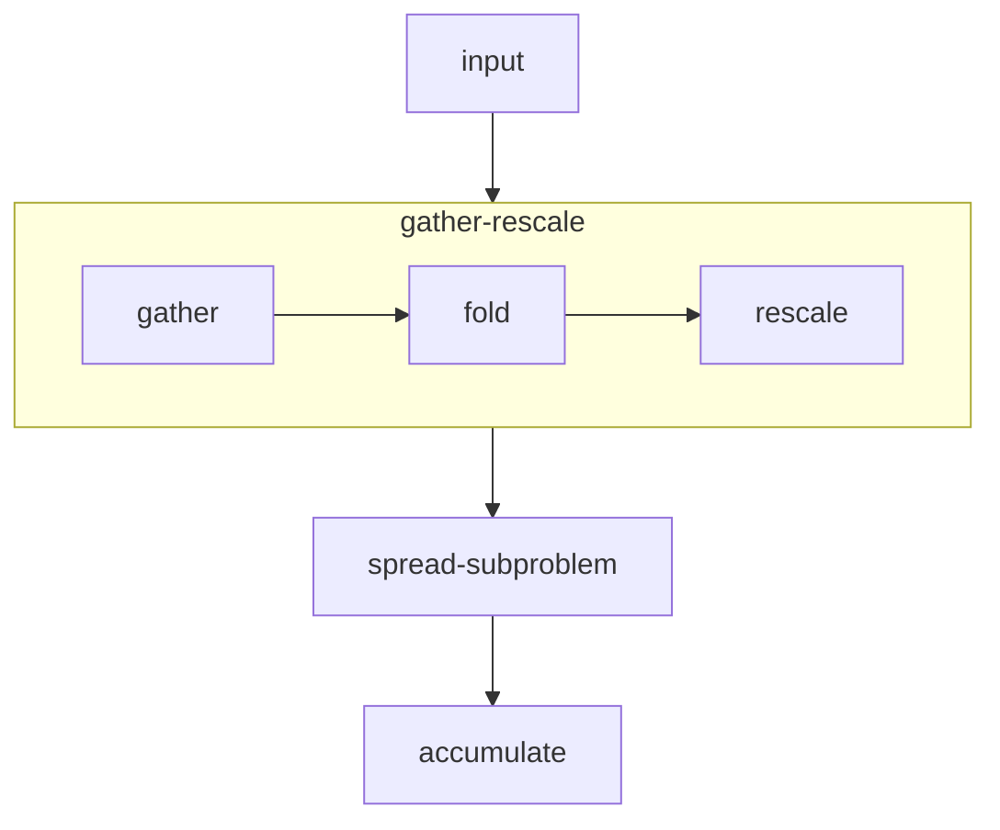

# Spreader design

This document details the design of the spreading operation in finufft.

Given a set of non-uniform points $x_i \in \mathbb{R}^d$, $i = 1, \dotsc, N$,
with associated weights $w_i \in \mathbb{C}$,
our goal is to evaluate, at all points $g_i \in \mathbb{R}^d$ of a regular grid
the value:
$$ \sum_{j = 1}^N \phi(x_j - g_i), $$
for some kernel $\phi$ to be defined later.

We separate the main spreading operation into the following flow.

We detail the API for each of the separate components below.

## Input

The input is given in the following fashion
- `int N`: the number of non-uniform points to process
- `FLT* coordinates[d]`: A list of d pointers, such that `coordinates[i][j]`
   gives the coordinate in the `i`th dimension for the `j`th point.
- `FLT* weights`: a pointer to an array of `2 * N` values, with `weights[2 * i]` and `weights[2 * i + 1]`
   representing respectively the real and complex parts of the weight of the non-uniform point.
- `int sizes[d]`: an array of `d` integers representing the size of the output grid.
- `int* sort_indices`: an array of integers, representing a permutation of 1 to `N`, which sorts the points
   in order to favour locality when building sub-problems.
```diff
- TODO: consider sorting in place prior to calling this function for better performance
```

## Gather-fold-rescale

This operation is intended to select a set of points in a compact region of space,
and collect such points in contiguous arrays.
This is done by selecting a set of points which represents a contiguous segments as indexed by `sort_indices`.
Note that if that ordering is unfavourable, this operation could potentially select points which cover a large subsets,
which reduces performance.
Additionally, the coordinates are rescaled to pixel coordinates if required, and initial
periodic boundary wrapping is performed.

The function has the following signature:
```c++
template<size_t Dim, typename T>
struct nu_point_collection {
   size_t num_points;
   std::array<T*, Dim> coordinates;
   T* weights;
};

template<size_t Dim, typename T>
void gather_and_fold(nu_point_collection<Dim, T>& output, nu_point_collection<Dim, T>& input, int const* sort_indices);
```

## Spread subproblem

This operation rasterizes the given array of non-uniform points into an appropriately sized and
padded subgrid by evaluating the kernel at the non-uniform points.
This function implements the main computational loop of the spreading procedure.

The function has the following signature:
```c++
template<size_t Dim>
struct grid_specification {
   std::array<int64_t, Dim> offsets;
   std::array<int64_t, Dim> extents;
};

struct kernel_specification {
   double es_c;
   double es_beta;
   int width;
};

template<size_t Dim, typename T>
void spread_subproblem(nu_point_collection<Dim, T> const& points, grid_specification<T> const& grid, T* output, kernel_specification const& kernel);
```

## Aggregation

This operation aggregates subgrids obtained from `spread_subproblem` into the main output grid, while wrapping out-of-bound parts
of the subgrid into the main grid.
This operation may operate concurrently with other aggregations into the main output grid, when subgrids are processed in parallel.
It should thus correctly synchronize or use atomic operations.

The function has the following signature:
```c++
template<size_t Dim, typename T>
void add_wrapped_grid(T* output_grid, T const* local_grid, grid_specification const& local_grid_specification, std::array<size_t, Dim> output_grid_size);
```

