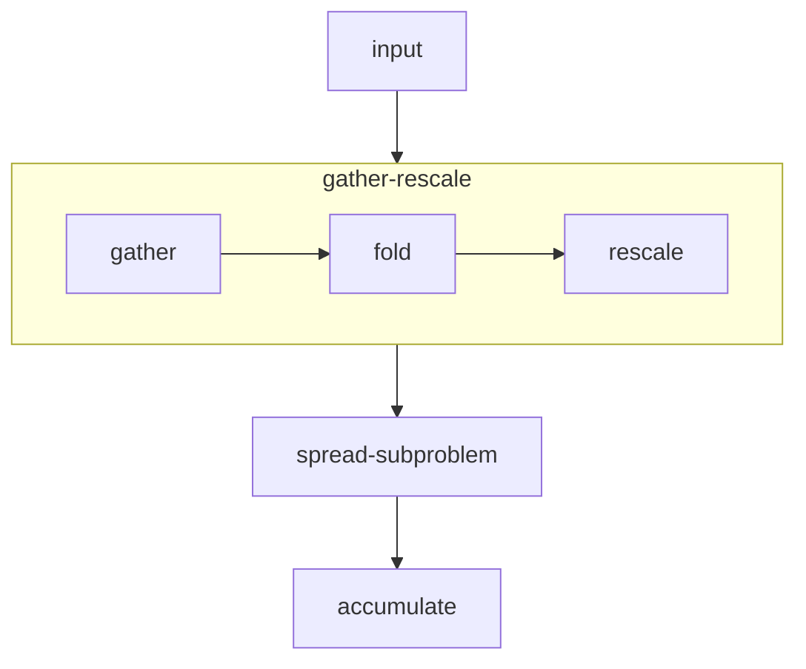

# Spreader design

This document details the design of the spreading operation in finufft.

Given a set of non-uniform points $x_i \in \mathbb{R}^d$, $i = 1, \dotsc, N$,
with associated weights $w_i \in \mathbb{C}$,
our goal is to evaluate, at all points $g_i \in \mathbb{R}^d$ of a regular grid
the value:
$$ \sum_{j = 1}^N \phi(x_j - g_i), $$
for some kernel $\phi$ to be defined later.

The input to the spreading (for a fixed set of parameters) is given as a collection
of non-uniform points in a AoS (array of structure) format, namely
```c++
template<typename T, size_t Dim>
struct nu_point_collection {
   size_t num_points;
   std::array<T*, Dim> coordinates;
   T* weights;
};
```

For a fixed set of parameters (e.g. dimension, target buffer size, input range),
the spreading operation is encapsulated as a function of type:
```c++
typedef void (*SpreadFunctor)(nu_point_collection<T, Dim> const& points, T* output);
```
with the `points` structure containing the input points to spread, and
`output` being a (potentially uninitialized) buffer representing the output
in contiguous column-major complex-interleaved format.

During plan creation, the program will request the creation of a function
object with the above signature by specifying the parameters of the spreading
problem.
```c++
SpreadFunctor make_spread_functor(
   kernel_specification const& kernel_spec,
   FoldRescaleRange input_range,
   std::array<std::size_t, Dim> output_size,
   Timer const& timer = {})
```
These parameters fully specify the spreading problem in the following fashion:
- kernel_spec: the parameters of the kernel used for spreading (in particular
      width of the kernel and exponential parameter).
- input_range: the range of the input data
- output_size: the size of the target buffer in pixels
- timer: an optional timer used to keep track of finufft internal timings.


At the moment, we have an implementation of the spread functor which dispatches
to the existing finufft code, and are in the process of implementing a variety
of optimized functors depending on problem size and hardware.


##  Design of existing implementation

We describe the abstract design of the current implementation in the following section.
We anticipate that optimized versions may deviate more substantially from the current design,
in order to leverage better data movement.
In particular, see the [design doc](../spreader_opt.md) for the architecture and design
of the optimized spreader.

We separate the main spreading operation into the following flow.

We detail the API for each of the separate components below.

```diff
+ TODO: the current API does not support correctly specifying strided formats for multi-dimensional inputs
+    which is important for better performance. This will be done in a second stage.
+ TODO: in many cases, functions may need to specify their requirement in terms of padding / alignment.
+    Specific APIs should also be defined for such.
```

## Input

The input is given in the following fashion
- `int N`: the number of non-uniform points to process
- `FLT* coordinates[d]`: A list of d pointers, such that `coordinates[i][j]`
   gives the coordinate in the `i`th dimension for the `j`th point.
- `FLT* weights`: a pointer to an array of `2 * N` values, with `weights[2 * i]` and `weights[2 * i + 1]`
   representing respectively the real and complex parts of the weight of the non-uniform point.
- `int sizes[d]`: an array of `d` integers representing the size of the output grid.
- `int* sort_indices`: an array of integers, representing a permutation of 1 to `N`, which sorts the points
   in order to favour locality when building sub-problems.
```diff
- TODO: consider sorting in place prior to calling this function for better performance
```

## Gather-fold-rescale

This operation is intended to select a set of points in a compact region of space,
and collect such points in contiguous arrays.
This is done by selecting a set of points which represents a contiguous segments as indexed by `sort_indices`.
Note that if that ordering is unfavourable, this operation could potentially select points which cover a large subsets,
which reduces performance.
Additionally, the coordinates are rescaled to pixel coordinates if required, and initial
periodic boundary wrapping is performed.

The function has the following signature:
```c++
template<size_t Dim, typename T>
void gather_and_fold(nu_point_collection<Dim, T>& output, nu_point_collection<Dim, T>& input, int const* sort_indices);
```

## Spread subproblem

This operation rasterizes the given array of non-uniform points into an appropriately sized and
padded subgrid by evaluating the kernel at the non-uniform points.
This function implements the main computational loop of the spreading procedure.
Note that for best efficiency, this function may request the data to be padded and aligned to specific multiples,
including:
1. Ensuring sufficient padding on the sides of the offset grid
2. Ensuring that the extents are divisible by a given factor
3. Ensuring that the number of non-uniform points is divisible by a given factor

As some implementation may need to amortize setup time for a given kernel specification,
(e.g. copying / computing polynomial weights), the subproblem functionality is split
into a setup phase and a computation phase.
We eventually plan for this setup phase to be performed during plan creation.

The function has the following signature:
```c++
template<size_t Dim>
struct grid_specification {
   std::array<int64_t, Dim> offsets;
   std::array<int64_t, Dim> extents;
};

struct kernel_specification {
   double es_beta;
   int width;
};

template<typename T, size_t Dim>
struct SpreadSubproblemFunctor {
   size_t num_points_multiple() const;
   std::array<size_t, Dim> extent_multiple() const;
   std::array<std::pair<double, double>, Dim> extent_padding();

   void operator()(T* output, nu_point_collection<Dim, T> const& points, grid_specification<T> const& grid)
};

template<typename T, size_t Dim>
SpreadSubproblemFunctor<T, Dim> setup_spreader(kernel_specification const& kernel);
```

## Aggregation

This operation aggregates subgrids obtained from `spread_subproblem` into the main output grid, while wrapping out-of-bound parts
of the subgrid into the main grid.
This operation may operate concurrently with other aggregations into the main output grid, when subgrids are processed in parallel.
It should thus correctly synchronize or use atomic operations.

The function has the following signature:
```c++
template<size_t Dim, typename T>
void add_wrapped_grid(T* output_grid, T const* local_grid, grid_specification const& local_grid_specification, std::array<size_t, Dim> output_grid_size);
```

